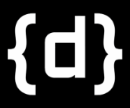

# Deforum Comfy Nodes

Deforum Comfy Nodes introduces a revolutionary approach to animation, combining the robustness of ComfyUI with the innovative techniques of frame warp, hybrid motion, and noising. This project leverages generative AI models to craft unique animation experiences, setting a new standard in the field of digital art and animation.

## Installation

To get started with Deforum Comfy Nodes, follow these steps:

a.:
1. Ensure you have the latest version of ComfyUI installed.
2. Use ComfyUI Manager to install Deforum Nodes

b.:
1. Ensure you have the latest version of ComfyUI installed.
2. Navigate to ComfyUI/custom_nodes
3. run git clone https://www.github.com/XmYx/deforum-comfy-nodes

## Usage

Using Deforum Comfy Nodes is straightforward. Here's how you can begin creating animations:

1. Launch ComfyUI
4. Load the example workflow from the examples folder.
3. Queue prompt, this will generate your first frame, you can enable Auto queueing, or batch as many images as long you'd
like your animation to be.

For advanced usage and customization options, refer to the documentation provided within the repository.

## Contribution

We welcome contributions from the community! If you're interested in improving Deforum Comfy Nodes or have ideas for new features, please follow these steps:

1. Fork the repository on GitHub.
2. Create a new branch for your feature or fix.
3. Commit your changes with clear, descriptive messages.
4. Push your changes to the branch and open a pull request.

Before contributing, please review the contribution guidelines detailed in `CONTRIBUTING.md`.

## License

Deforum Comfy Nodes is licensed under the MIT License. For more details, see the LICENSE file in the repository.

## Community and Support

Join our Discord community to discuss Deforum Comfy Nodes, share your creations, and get help from the developers and other users: [Join Discord](https://discord.gg/deforum)

[Visit our website](https://deforum.studio)

Thank you for your interest in Deforum Comfy Nodes. We're excited to see the incredible animations you'll create!